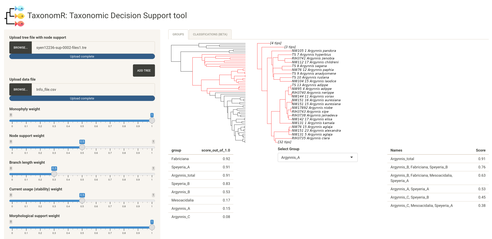

# TaxonomR: taxonomic decision support tool
## Overview  
TaxonomR is an interactive application designed to facilitate taxonomic ranking decisions and make them more transparent, explicit, and accessible to interpretation and comparison across alternative classifications. The program is developed using the Shiny package for R programming language and is available as an online application (https://oksanav.shinyapps.io/TaxonomR/). Source R script for the Shiny app is available in the [shiny_app files](https://github.com/OksanaVe/TaxonomR/tree/main/shiny_app%20files) directory.  

  
## Example usage  
TaxonomR has a very simple and accessible interface for users of all levels. The general workflow includes only two steps – uploading input files and specifying a prioritization scheme using interactive sliders to set preferred weights for different decision-making criteria. The second step is a dynamic procedure – TaxonomR reacts to the information provided by the user and outputs updated scores for each taxonomic group included in the analysis. The output is updated every time user changes any of the input weight values or data files.  
   
**a.**	Launch online application available at (https://oksanav.shinyapps.io/TaxonomR/)  
**b.**	Get familiar with the user interface:  
   
   
**Figure 1.** TaxonomR interface. A – user input panel; B – output field.   
   
**c.**	Upload tree file(s) by clicking the “Browse” button (Fig. 3A) at the top of the user input panel and navigating to the tree file saved on your computer. If you need to upload another tree file with additional information, click the “Add Tree” button and repeat previous steps to upload additional file (Fig. 3B). If you have a single tree file which contains all necessary information (branch lengths, support values, and divergence dates), you do not need to use the “Add Tree” option.  
  
**Figure 2.** Upload a tree with branch length and node support values by clicking the “Browse” button (A). If a second tree file needs to be uploaded, click the “Add Tree” button (B) and upload another file in the new tree upload line.  
   
**d.**	Next, upload data file by clicking the “Browse” button in the data file upload field and navigating to your csv-formatted file. Once both tree and data files are uploaded, TaxonomR will update the output view field to show the tree and a list of taxonomic groups provided in the data file (Fig. 4). You can choose a taxonomic group to highlight and show as a zoom-in section by selecting that group from the “Select Group” drop-down menu. In the zoomed view, taxa that do not belong to the group are collapsed and shown as number of taxa in square brackets.  
   
**Figure 3.** A screenshot of the TaxonomR interface with uploaded tree and data files. The output field shows the overall view of the supplied phylogenetic tree (tree view on the left) and a zoomed-in portion of the tree highlighting a group selected from the “Select Group” drop-down menu (clade view in the centre).   
   
Below the tree view panel, you will see a list of all taxonomic groups specified in the data file. Initially, groups do not have score values; instead, each group has an ‘NA’ value which is updated to a calculated numeric value once you start specifying weights of the decision-making criteria in the user input panel on the left.  
   
**e.**	The last step is to start specifying weights of the decision-making criteria by adjusting sliders in the user input panel on the left. Each criterion is weighted on a scale from 0 to 1. Criteria that are considered to be of primary importance to the taxonomic ranking should be assigned higher weights than criteria of secondary importance. Figure 5 shows a simple example of weighting scheme that prioritizes monophyly as well as puts high weight on the timing of divergence of the groups. Under this scheme, the output suggested classification includes a single group (Argynnis_total) that originated within a narrow time band around 9 Mya (age range from 8.7 to 9.5 Mya).  

**Figure 4.** Screenshot of TaxonomR showing a simple example of a weighting scheme that prioritizes monophyly and divergence time. Suggested classification is shown on the right.  
   
Finally, remember that taxonomic ranking decisions are inherently subjective, and it is important to make them transparent and explicit to reduce vagueness and make decisions accessible to a wide audience to engage interest of specialists and anyone interested in the topic.   
   
